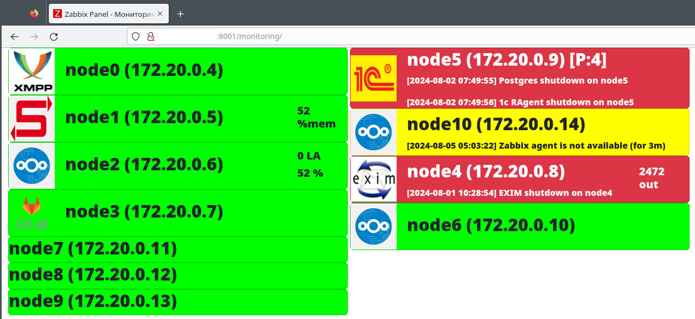
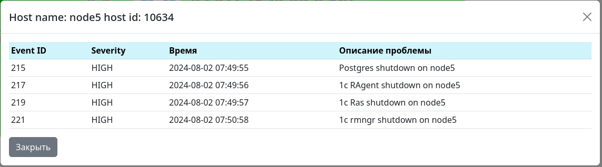
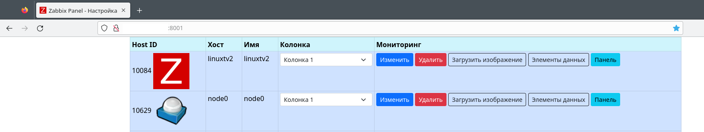
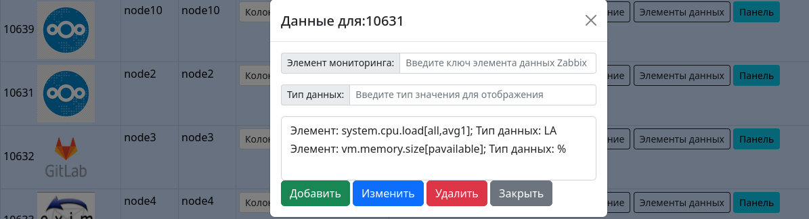

## Zpanel. Панель мониторинга Zabbix. Три колонки.

### Пример отображения в браузере:

### Детальный просмотр проблем:

### Настройка элементов мониторинга:

### Элементы данных в карточке :


## Установка Zpanel:
### 1. Создание БД Postgres + пользователя для сервиса Zpanel:
```
create database zpanel;
CREATE USER zpanel WITH PASSWORD 'zpanel';
GRANT ALL PRIVILEGES ON DATABASE "zpanel" to zpanel;
```
### 2. Созлание таблиц для БД
```
python db.py
```
### 3. Установка утилит виртуального окружения
```
sudo apt install virtualenv python3-venv
```
### 4. Копирование git репозитория + создание виртуального окружения
```
cd /%root%/
example root dir: cd /var/www
git clone git clone https://github.com/r2d2-lex/zpanel.git

cd /%root%/zpanel
python3 -m venv venv
```
### 4.1 Обновление pip
```
python -m pip install --upgrade pip
```
### 5. Активация виртуального окружения
```
source ./venv/bin/activate
```
### 6. Установка зависимостей сервиса
```
pip install -r requirements.txt
+ Может понадобится: apt-get install --reinstall libpq-dev
```
### 7. Создайте конфиг и установите нужные переменные:
```
cd /%root%/zpanel/
cp config-example.py config.py
```
### 8. Установите gunicorn
```
pip install gunicorn
8.1 Test: gunicorn --bind 0.0.0.0:8000 main:app -k uvicorn.workers.UvicornWorker
8.2 Copy service/zpanel.service: cp service/zpanel.service /etc/systemd/system/zpanel.service
```
### 9. Запустите сервис:
```
$ sudo systemctl start zpanel.service
$ sudo systemctl enable zpanel.service
```
### 9.1 Проверьте состояние работы сервиса:
```
$ sudo systemctl status zpanel.service
```
### 10. Настройка nginx
```
10.1 ln -s /etc/nginx/sites-available/zpanel /etc/nginx/sites-enabled/
10.2 nginx -t
10.3 systemctl reload nginx
```

### 11. Firefox стартовый скрипт:
```
firefox -url http://zabbix.local:8000/monitoring/ &
xdotool search --sync --onlyvisible --class "Firefox" windowactivate key F11
```
### 12. Настройка логов
```
mkdir /var/log/zpanel && chown www-data. /var/log/zpanel && systemctl restart zpanel.service
cp service/logrotate.d/zpanel /etc/logrotate.d/
systemctl restart logrotate.service
```

### Запуск контейнера в Docker:
```
docker build -t zpanel .
docker run --name=zpanel --restart unless-stopped -d -p 8000:8000 zpanel
```

### Zabbix выполнить внешний скрипт:
```
/etc/zabbix/zabbix_agentd.conf
UserParameter=test,/home/user/test.sh

Create item:
proc.num[Service]

Create trigger:
Name: Service shutdown on {HOST.NAME}
{hostname:proc.num[Service].last(#2)}=0
```

### Настройка миграций Alembic:
```
After creating a migration, either manually or as --autogenerate, 
you must apply it with alembic upgrade head. If you used db.create_all() 
from a shell, you can use alembic stamp head to indicate that the current 
state of the database represents the application of all migrations.
$ alembic stamp head

$ alembic init -t async <script_directory_here>
После установки переменных в alembic.ini:
$ alembic revision --autogenerate -m "First migration"
Запуск  миграции:
$ alembic upgrade head или $ alembic upgrade %revision%
```
### Настройка Firefox:
```
about:config:
"browser.sessionstore.max_resumed_crashes" ставим значение "0"
Также ставим значение в ноль у параметров:
browser.sessionstore.max_tabs_undo
browser.sessionstore.max_windows_undo
browser.sessionstore.resume_from_crash ставим в FALSE
```

### Настройка POSTGRES:
```
/etc/postgresql/14/main/postgresql.conf
max_connections = 100 - установите больше, чтобы не появлялось сообщение:
zabbix@zabbix FATAL:  remaining connection slots are reserved for non-replication superuser connections
systemctl restart postgresql.service
```

## Тестирование:
### Настройка тестов:
Для запуска тестов настройте переменные в config.py, например:
```
TEST_HOST = '127.0.0.1'
TEST_LOGIN = 'login'
TEST_PASSWORD = 'password'
TEST_DB = 'zpanel_test'
```

### Запуск тестов 
В корневой директории проекта выполните команду:
```
shell$> pytest
```
